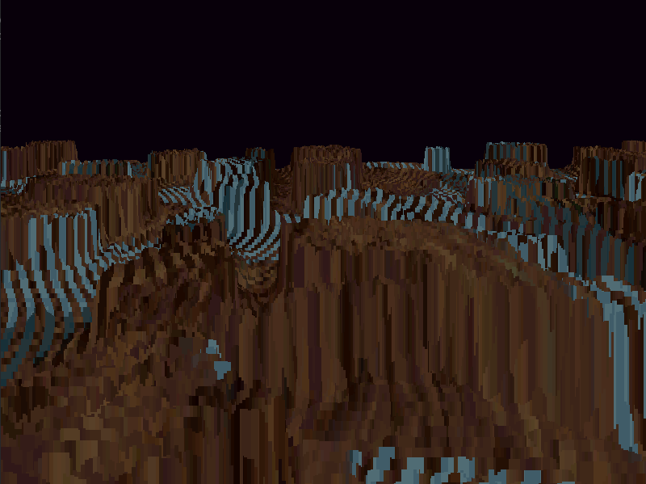
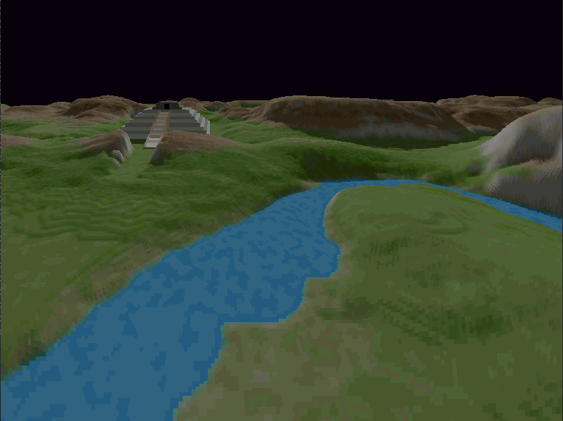
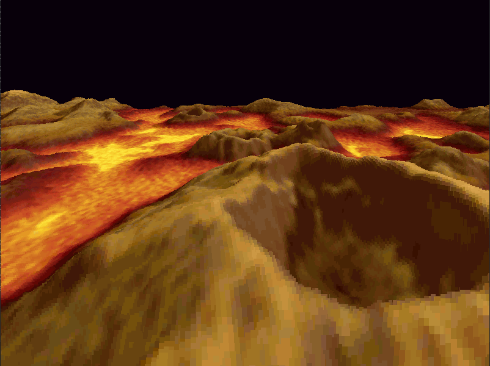

# voxel space renderer

A simple [Voxel Space](https://github.com/s-macke/VoxelSpace) renderer written in [Zig](https://ziglang.org) 0.13.0

## Features

- [x] Rendering
- [x] Movement
- [x] Map Changing
- [ ] Color Map Changing

## Controls

|  Key   |    Action    |
| ------ | ------------ |
|   W    | Move Forward |
|   A    | Move Left    |
|   S    | Move Down    |
|   D    | Move Right   |
|   Q    | Turn Left    |
|   E    | Turn Right   |
| Space  | Go Up        |
| Shift  | Go Down      |
| Comma  | Prev Map     |
| Period | Next Map     |

## Issues

For some reason certain maps have a strange visual bug

## Screenshots

